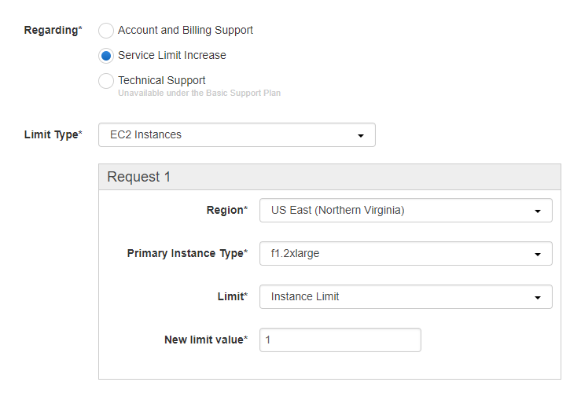

DETI/UFC - Cursos de Eng. de Computação e Eng. de Telecomunicações

Elaborada por  Jardel Silveira e Vanessa Rodrigues

# ** Criação de uma conta na AWS Educate e Solicitação da Instância EC2 F1**

**Descrição**

Esta prática objetiva mostrar a criação de uma conta na AWS Educate para o uso das instâncias do tipo EC2, que permitem o desenvolvimento e implementação de  projetos para FPGAs. 

**Parte 1 - Criar uma conta de estudante na AWS**

1. Criar uma conta da AWS no link: [https://portal.aws.amazon.com/billing/signup#/start](https://portal.aws.amazon.com/billing/signup#/start)

2. Após confirmada a criação da conta, é necessário inscrever-se como Aluno na AWS. Para isso, acesse o link [https://www.awseducate.com/Registration](https://www.awseducate.com/Registration) e escolha a opção **Student**.

3. Preencha o formulário de cadastro com suas informações. **Utilize um e-mail institucional. **

4. Na etapa seguinte, selecione a opção **Click here to enter an AWS Account ID.** Nessa etapa será necessário informar o ID da conta criada anteriormente. Para verificar essa informação, entre no link [https://console.aws.amazon.com/billing/home?#/account](https://console.aws.amazon.com/billing/home?#/account), logado em sua conta.

5. Levarão alguns dias para a verificação da solicitação. Após verificado,  a AWS enviará um e-mail com as informações da sua conta e um código promocional que será usado para a atribuição dos créditos cedidos pela AWS.

**Parte 2 - Solicitar o acesso à instância f1.2xlarge**

1. Para ter acesso a instância f1.2xlarge, que possui uma FPGA conectada, é necessário realizar uma solicitação. Para isso, acesse o link [https://console.aws.amazon.com/support/home](https://console.aws.amazon.com/support/home) e clique em **Create Case**.

2. Em **Regarding **e** Limit Type **escolha as opções mostradas na imagem abaixo: 

	

3. Em **Use Case Description **será necessário escrever (em inglês) uma justificativa para que a solicitação seja atendida.

**Parte 3 - Configurar a AWS CLI e o Amazon EC2**

1. Faremos uso da AWS CLI, que é uma ferramenta de código aberto criada com base no AWS SDK for Python (Boto) que fornece comandos para interagir com os serviços da AWS. 

2. A AWS CLI já foi instalada previamente nos PCs do laboratório, mas para começar a usá-la é necessário fazer a configuração. Para uso geral, o comando aws configure é a maneira mais rápida de configurar a AWS CLI.	

A AWS CLI solicitará quatro informações. O ID da chave de acesso da AWS e a chave de acesso secreta da AWS são as credenciais de sua conta. Para criá-las acesse a página [https://console.aws.amazon.com/iam/home#/home](https://console.aws.amazon.com/iam/home#/home), clique em Users e crie um novo usuário com permissões de Admin. Obtenha as informações de Acess Key ID e secret Acess Key. 

No terminal digite** aws configure** e insira as informações obtidas (O ID da chave de acesso da AWS e a chave de acesso secreta). Para a região insira us-east-1 e para o formato de saída defina json.

3. A próxima etapa é configurar os pré-requisitos para a execução de uma instância do EC2 que podem ser acessados usando o SSH. Para fazer todas as configurações recomendadas pela AWS é necessário seguir o tutorial descrito no link [https://docs.aws.amazon.com/AWSEC2/latest/UserGuide/get-set-up-for-amazon-ec2.html](https://docs.aws.amazon.com/AWSEC2/latest/UserGuide/get-set-up-for-amazon-ec2.html) . Porém, para esta prática serão necessárias apenas as configurações para  criar um security group e uma key-pair. Essas configurações serão descritas nos ítens a seguir.

4. Primeiro, crie um novo security group e em seguida, adicione uma regra que permite o tráfego de entrada na porta 22 para o SSH. Guarde o ID do security group para uso posterior.

$ **aws ec2 create-security-group --group-name nomeDoSecurityGroup-sg --description "Descricao do security group"**

{
    "GroupId": "sg-b018ced5"
}


$**aws ec2 authorize-security-group-ingress --group-name nomeDoSecurityGroup-sg --protocol tcp --port 22 --cidr ****_0.0.0.0/0_**

5. Em seguida, crie uma key pair. Isso permite que você se conecte à instância.

$ **aws ec2 create-key-pair --key-name nomeDaKeyPair-key --query 'KeyMaterial' --output text > nomeDaKeyPair-key.pem**

 	Esse comando fará com que seja realizado o download de um arquivo .pem, que deverá ser guardado em um diretório de fácil acesso.

6. No Linux, é necessário alterar o modo de arquivo, de forma que somente você tenha acesso ao arquivo de chave.

	$ **chmod 400 devenv-key.pem**

**Referências**

* Amazon Web Services. Hardware Development Kit (HDK) e Software Development Kit (SDK) [internet]. [Acesso em: 26 dez. 2017]. Disponível em: https://github.com/aws/aws-fpga/tree/master/hdk/cl/examples

* Amazon Web Services. Instâncias F1 do Amazon EC2 [internet]. [Acesso em: 26 dez. 2017]. Disponível em: [https://aws.amazon.com/pt/ec2/instance-types/f1/](https://aws.amazon.com/pt/ec2/instance-types/f1/)

* Amazon Web Services. Documentação do Amazon Elastic Compute Cloud [internet]. [Acesso em: 26 dez. 2017]. Disponível em: https://aws.amazon.com/pt/documentation/ec2/

