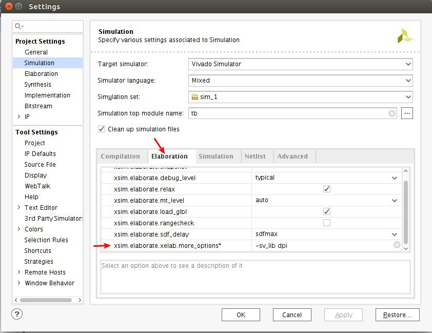
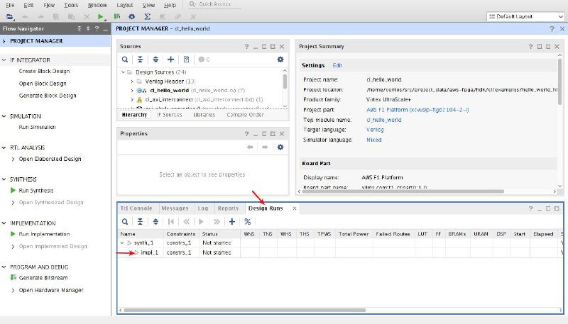

DETI/UFC - Cursos de Eng. de Computação e Eng. de Telecomunicações

Elaborada por Jardel Silveira e Vanessa Rodrigues

# **Executando e simulando o exemplo CL hello world com a GUI do Vivado**

**Descrição**

Nesta prática vamos executar o exemplo CL hello_world, que foi usado na prática [Criação de uma Amazon FPGA Image (AFI) do exemplo CL hello_world](https://github.com/vanros/Praticas-SEDR-AWS/blob/master/Pratica%201/_Pr%C3%A1tica%201-%20Cria%C3%A7%C3%A3o%20de%20uma%20Amazon%20FPGA%20Image%20(AFI)%20do%20exemplo%20CL%20hello_world.md). Porém não usaremos o modo batch como anteriormente, ao invés disso, faremos o uso da interface gráfica do vivado para a sintetização e a simulação do  projeto.

**Objetivos de Aprendizagem**

*  Acesso à interface gráfica da instância t2.2xlarge.

* Acesso a interface gráfica do vivado instalado na instância t2.2xlarge.

* Simulação do exemplo hello_world.

*  Implementação e sintetização (geração do arquivo .tar pela interface do Vivado).

**Parte 1: Configurar a máquina local e a instância para permitir o acesso a interface gráfica**

1. Execute uma instância EC2 t2.2xlarge, seguindo o procedimento descrito na prática [Criação de uma Amazon FPGA Image (AFI) do exemplo CL hello_world](https://github.com/vanros/Praticas-SEDR-AWS/blob/master/Pratica%201/_Pr%C3%A1tica%201-%20Cria%C3%A7%C3%A3o%20de%20uma%20Amazon%20FPGA%20Image%20(AFI)%20do%20exemplo%20CL%20hello_world.md).

2. Na máquina local, execute o seguinte comando para permitir que seja acessada por qualquer host.
```bash
$ xhost +
```

3. Na instância t2.2xlarge, execute o seguinte comando para verificar se o SSH está configurado para aceitar que conexões  através do modo gráfico.
```bash
$ cat /etc/ssh/sshd_config | grep X11Forwarding
```

O resultado deste comando deverá ser ```"X11Forwarding yes"```.

4. Ainda na instância t2.2xlarge, execute o seguinte comando para instalar o xauth
```bash
$ sudo yum install xauth.
```

5. Feche a sessão SSH (```exit```)e em seguida reconecte-se adicionando no comando de conexão o parâmetro -X, como no exemplo abaixo:
```bash
$ ssh -i nomeDaKeyPair.pem -X centos@54.183.22.255
```


6. Execute o comando.
```bash
$ export DISPLAY=localhost:10.0
```

7. Instale o editor de texto gedit com o seguinte comando:
```bash
$ sudo yum install gedit
```
	

8. Execute o comando ```gedit```. A interface do gedit deverá abrir. Isso significa que a configuração para o uso da interface foi realizada com sucesso.


**Parte 2: Configurando o  IP Integrator**

1. Configure o HDK
```bash 
$ git clone https://github.com/aws/aws-fpga.git $AWS_FPGA_REPO_DIR
$ cd $AWS_FPGA_REPO_DIR
$ source hdk_setup.sh
```
2. Entre no diretório ```~/.Xilinx/Vivado``` e verifique se o arquivo ```init.tcl```  ou o arquivo ```Vivado_init.tcl``` existe dentro desse diretório. Caso nenhum destes dois arquivos existam, crie o arquivo com o seguinte comando
```bash 
$ touch Vivado_init.tcl
```

3. Obtenha o path absoluto de $HDK_SHELL_DIR com o seguinte comando
```bash 
$ echo $HDK_SHELL_DIR
```

4.  No arquivo init.tcl ou Vivado_init.tcl, adicione a seguinte linha

```source <saída do comando echo $HDK_SHELL_DIR>/hlx/hlx_setup.tcl```

Toda vez que o Vivado for executado, esse script sempre será fornecido e os recursos do integrador de IP serão carregados automaticamente.

Obs:  Você poderá editar o arquivo usando o gedit previamente instalado, executando o comando ``` $ gedit Vivado_init.tcl```

5. Execute o vivado usando o comando ```vivado```

6. Uma vez que o vivado tenha sido executado com a interface gráfica, feche-o e retorne ao terminal. 

7. Feche a sessão SSH e termine a instância.

**Parte 3: Simulação do exemplo hello_world usando o ambiente de desenvolvimento local**

**Configurando o Vivado e o HDK/SDK**

1. Faça login na máquina virtual que está sendo executada no computador do laboratório, utilizando as seguintes informações:
```bash
Usuário: osboxes.org
Senha: osboxes.org
```
2. Entre no diretório `aws-fpga-master`.
3. Execute o comando `source /opt/Xilinx/SDx/2017.1.op/settings64.sh`.
4. Execute o comando `source hdk_setup.sh`.
5. Execute o comando `source sdk_setup.sh`. (Informe a senha `osboxes.org`).

**Configurando as variáveis de ambiente**

2. Adicione as seguintes variáveis de ambiente para clock recipes e IDs para o exemplo hello_world
```bash
$ export CLOCK_A_RECIPE=0

$ export CLOCK_B_RECIPE=0

$ export CLOCK_C_RECIPE=0

$ export device_id=0xF000

$ export vendor_id=0x1D0F

$ export subsystem_id=0x1D51

$ export subsystem_vendor_id=0xFEDD
```
**Criando Exemplo de Design**

3. Mude para o diretório ```/hdk/cl/examples/hello_world_hlx```

4. Execute o vivado usando o comando ```vivado```. Uma vez que a GUI tiver sido carregada, clique no console TCL

5. Digite o comando ```aws::make_rtl -examples cl_hello_world``` para criar o exemplo ```hello_world_hlx```. O exemplo será gerado no diretório ```cl/examples/hello_world_hlx/example_projects```. O projeto do vivado será o arquivo ```hello_world.xpr``` contido na pasta examples_projects.

**Simulação**

6. Clique em ```Simulation->Run Simulation->Run Behavioral Simulation```

7. Adicione os sinais necessários para a simulação

8. Digite o comando  ```run -all``` no TCL console

**Parte 4: Simulação DPI com test_hello_world.c**

1. No navigator Flow, clique com o botão direito em ``Simulation`` e selecione ``Simulation Settings``

2. Selecione a caixa … em Verilog options e modifique o valor de TEST_NAME para ```test_null```, para desativar o sv stimulus

```TEST_NAME = test_null ```


3. No TCL console, copie e cole o seguinte comando para setar o path para criação do .so com o script test_hello_world.c. 

```bash
set_property -name {xsim.compile.tcl.pre} -value $::aws::make_faas::_nsvars::script_dir/../../hlx_examples/build/RTL/cl_hello_world/verif/scripts/dpi_xsim.tcl -objects [get_filesets sim_1]
```

4. Em Project Manager, clique com o botão direito em ```Simulation``` e selecione ```Simulation Settings```

5. Na tab ```Elaboration``` adicione o valor de ```-sv_lib dpi ``` para ```xsim.elaborate.xelab.more_options```

	

	

	

6. Execute a **Simulação** novamente.

7. O teste executado foi o test_hello_world.c, que está no diretório
``aws-fpga-master/hdk/cl/examples/cl_hello_world/software/verif_rtl/src/test_hello_world.c``.

**Parte 5: Implementando o arquivo Design/Tar**

1. Na tab ```Design Runs```, clique com o botão direito em  ```impl_1``` e selecione ```Lauch Runs```

2. Clique em OK na caixa de diálogo ```Launch Runs``` e depois clique em OK na caixa de diálogo ```Missing Synthesis Results```

	

3. Após isso, a sintetização e a implementação serão executadas

4. Após terminada a execução, o arquivo .Developer_CL.tar será gerado no diretório ```example_projects/cl_hello_world.runs/faas_1/build/checkpoints/to_aws/```

5. Com o arquivo .tar gerado é possível criar uma uma AFI para carregá-la em uma instância F1. Para isso, deve-se seguir a prática [Criação de uma Amazon FPGA Image (AFI) do exemplo CL hello_world](https://github.com/vanros/Praticas-SEDR-AWS/blob/master/Pratica%201/_Pr%C3%A1tica%201-%20Cria%C3%A7%C3%A3o%20de%20uma%20Amazon%20FPGA%20Image%20(AFI)%20do%20exemplo%20CL%20hello_world.md), a partir da parte 1 ítem 9.

**Referências**

* Amazon Web Services. Hardware Development Kit (HDK) e Software Development Kit (SDK) [internet]. [Acesso em: 26 dez. 2017]. Disponível em: https://github.com/aws/aws-fpga/blob/master/hdk/docs/IPI_GUI_Vivado_Setup.md

* ALMEIDA, Bruno. **Acessando modo gráfico da sua instância EC2. **2013. Disponível em: <http://blog.rivendel.com.br/2013/09/13/acessando-modo-grafico-da-sua-instancia-ec2/>. Acesso em: 20 fev. 2018.

