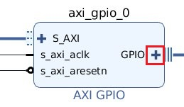
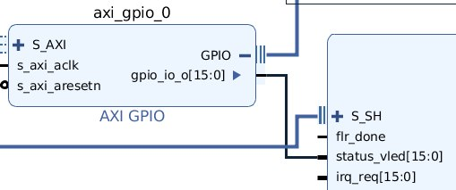

DETI/UFC - Cursos de Eng. de Computação e Eng. de Telecomunicações

Elaborada por Jardel Silveira e Vanessa Rodrigues

# **Executando um  exemplo do IP Integrator com AXI GPIO e AXI BRAM (hello_world)**

**Descrição**

Esta prática aborda o procedimento para a configuração do IP AWS com a interface BAR1 (AXI4-Lite Master Interface) e a interface PCIS (AXI4 Master). Neste exemplo, o IP AXI GPIO é adicionado ao design para controlar o VLED e o IP AXI BRAM é adicionado ao design da interface PCIS (AXI4 Master).

O VLED é definido com base na gravação do valor 0xAAAA no registrador slave GPIO AXI (0x0) para conduzir o VLED. O valor é lido usando a task Verilog tb.get_virtual_led ou fpga-get-virtual-led na F1. 

As interfaces PCIS gravam dados ASCII no espaço de memória AXI BRAM e lêem esses endereços para imprimir “Hello World!” Na simulação ou na F1.


**Objetivos de Aprendizagem**

*  Configuração do IP AWS com a interface BAR1 e a interface PCIS.

* Simulação do exemplo hello_world.

**Configurando o Vivado e o HDK/SDK**
1. Entre no diretório `aws-fpga-master`.
2. Execute o comando `source /opt/Xilinx/SDx/2017.1.op/settings64.sh`.
3. Execute o comando `source hdk_setup.sh`.
4. Execute o comando `source sdk_setup.sh`. (Informe a senha `osboxes.org`).

**Criando a estrututra de diretório e o Projeto Vivado**
1. Entre no diretório `hdk/cl/examples`.
2. Crie um diretório em examples, como `hello_world_vivado_<seuNome>`, e entre nesse diretório.
  
  3. Inicie o Vivado usando o comando `vivado`.
  
  4. Crie um projeto digitando, no console TCL, o comando `create_project -name hello_world`.
  
  5. Digite o seguinte comando, no console TCL, que altera as configurações do projeto para a AWS e cria o diagrama de blocos com o IP da AWS adicionado.
  `aws::make_ipi`
  
**Configurando o Diagrama de Blocos**

  **Configurando o IP AWS**
  1. Dê um clique duplo sobre o bloco IP AWS. Em Interfaces IP, selecione ` Use BAR1 Register Interface (M_AXI_BAR1)`, `Use PCI Slave-access Interface (M_AXI_PCIS)`, e `Use Auxiliary (non-AXI) Signal Ports`. Isso habilita a interface AXI4-Lite Master (para AXI GPIO), a interface AXI4 Master (para AXI BRAM) e os inputs/outputs VLED/VDIP. Após isso, selecione `OK`. 
  
  
 
 O IP AWS é configurado para um clock usando o Grupo-A com o padrão clock recipe, que configura um clock de 125 MHz.
 
 **Adicionando/Configurando o AXI GPIO**
 1. Clique com o botão direito na tela e selecione ``Add IP``. Na barra de pesquisa, digite AXI GPIO e dê um clique duplo em AXI GPIO.
 
 2. Dê um clique duplo  sobre o bloco  `axi_gpio_0` para configurar o IP.
 
 3. Na seção GPIO, selecione `All Outputs` e defina GPIO Width para `16`. Após isso, selecione `OK`.
  
  

**Adicionando/Configurando o AXI BRAM**
1. Clique com o botão direito na tela e selecione ``Add IP``. Na barra de pesquisa, digite AXI BRAM e dê um clique duplo em AXI BRAM Controller.

2. Dê um clique duplo  sobre o bloco  `axi_bram_ctrl_0` para configurar o IP.

3. Defina Data Width para `512` e clique em OK. Isso é para corresponder à largura de dados de 512 bits da interface principal do PCIS AXI4.
  
   
  
 **Conectando o Design**
 1. Selecione `Run Connection Automation `  no top do block diagram na seção verde destacada.
 
 2. Selecione `axi_bram_ctrl_0/BRAM_PORTA ` e depois `BRAM_PORTB` e selecione `Auto`. 
 
 3. Selecione ` axi_bram_ctrl_0/S_AXI` e verifique se `Master` está definido para `/f1_inst/M_AXI_PCIS` e as outras opções para `Auto`.
 
 4. Selecione `axi_gpio_0/S_AXI`. verifique se `Master` está definido para `/f1_inst/M_AXI_BAR1` e as outras opções para `Auto`. Selecione `axi_gpio_0/GPIO`, que será configurado manualmente após a execução da automação de conexão. Após isso, selecione `OK`
 
 5. Expanda axi_gpio_0/GPIO selecionando o `+`.
 
    
 
 6. Conecte `gpio_io_o [15: 0]` no bloco `f1_inst` e faça uma conexão com `status_vled [15: 0]`. Selecione `Run Connection Automation `
   
    
  
  **Tab Adress Editor**
  1. Selecione a Tab `Adress Editor` no topo do block diagram.
  
  2. Por padrão, a instância AXI BRAM é configurado com espaço de endereço de 64K, iniciando no endereço 0xC0000000. O espaço de endereço pode ser aumentado ou diminuído selecionando um valor diferente para Intervalo.
  
  3. A instância AXI GPIO tem um espaço de endereço de 4K, que é refletido no endereçamento para M_AXI_BAR1 que começa em 0x00000000.
 
 **Salvando e Validando o Design**
 1. Salve o block diagram e selecione `Tools->Validate Design`.
 
 2. Após a validação ser bem sucedida, selecione `OK`.
 
 **Adicionando simulation sources do exemplo de design (cl_hello_world)**
 1. Na tab `Project Manager`, em Flow Navigator, selecione `Add Sources -> Add or create simulation sources -> Add Files`.
 
 2. Adicione o arquivo `hdk/common/shell_stable/hlx/hlx_examples/build/IPI/hello_world/verif/test_cl.sv`.
 
 3. Desmarque a opção `Scan and add RTL includes files into project`.
 
 4. Desmarque a opção `Copy sources into project to link to the source files`.
 
 5. Selecione `Add sources from subdirectories`.
 
 6. Selecione `Include all design sources for simulation`. Após isso, clique em `Finish`.
 
 7. Clique com o botão direito em `SIMULATION` em `Project Manager` e selecione `Simulation Settings`.
 
 8. Em `Verilog options`, selecione a caixa `...`.
    
    
 
 9. Mude os seguintes nomes (Possivelmente já estará configurado).
  ```bash
 CL_NAME=cl_top

TEST_NAME=test_cl
 ```
 
 9. Clique em `OK`. Clique em `Apply`. Clique em `OK` para voltar ao projeto Vivado.
 
 **Executando a Simulação**
 1. Em Flow Navigator, selecione `Simulation->Run Simulation->Run Behavioral Simulation`.
 
 2. Adicione os sinais necessários na simulação.
 
 3. No console TCL, execute o comando `run -all`. Se `Criticals Warnings` aparecerem, clique em `OK` e execute o comando novamente. 
	

	

**Referências**

* Amazon Web Services. Hardware Development Kit (HDK) e Software Development Kit (SDK) [internet]. [Acesso em: 02 dez. 2017]. Disponível em: https://github.com/aws/aws-fpga/blob/master/hdk/docs/IPI_GUI_Examples.md#ipitut

